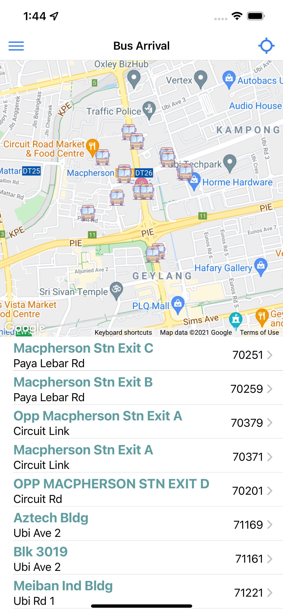
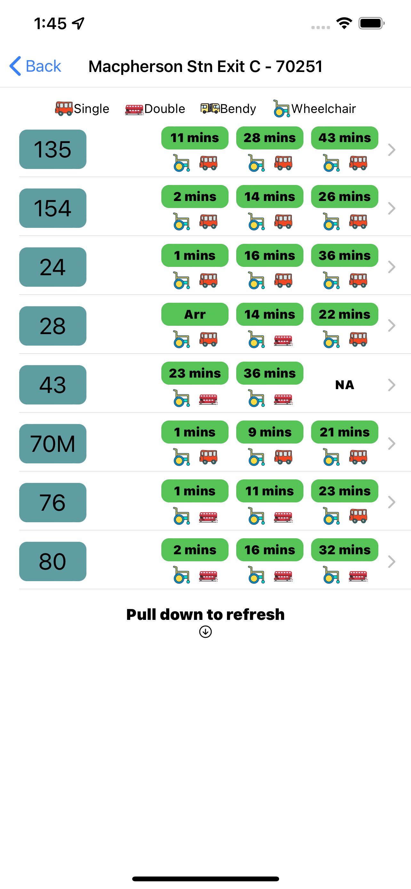

# Transport Guardian Mobile Application

## Usage

This application is developed to provide real time bus arrival timings.

<br />

## Dev Framework / Library

This application is developed using Ionic and React. To learn more about the framework and library, [click here](https://ionicframework.com/) to explore more about Ionic and [click here](https://reactjs.org/) to learn more about React.

<br />

#### To run and test this application on local machine

1. git clone from this repo.

```bash
git clone https://github.com/JoabChua/ionic-react-sgbus
```

2. Install the dependencies that are required to serve this on a localhost server.

```bash
npm install
```

3. To run and start the application, run the command below.

```bash
ionic serve
```

4. Head over to your browser. [click here](http://localhost:8100) to open.

5. Please ensure that you provide your own google API key and LTA data mall API key for the app to load properly.




## Development In Progress

1. This project is currently in progress, more features are coming up.
2. Favourite Bus Stop, Bus Service, Bus at specifc Bus Stop.
3. More colorful themes are coming.

<br />

## Copyright

This application is fully created by JoabChua with Ionic React.
